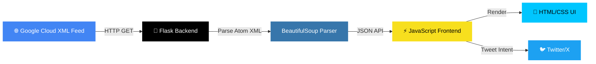

<div align="center">

# 🚀 BigQuery Release Notes Tracker

### _Stay ahead of every Google BigQuery update — fetch, filter, search & tweet!_

[](https://python.org)
[](https://flask.palletsprojects.com)
[](https://developer.mozilla.org/en-US/docs/Web/JavaScript)
[](LICENSE)
[](https://github.com/khushisinghrajput234-coder/Khushi-kumari-event-talks-app/stargazers)

<br/>


---

<p align="center">
  <b>A premium, dark-themed web application that fetches the latest BigQuery release notes<br/>from Google's official Atom feed and lets you share updates directly to Twitter/X.</b>
</p>

</div>

<br/>

## 📑 Table of Contents

<details>
<summary>Click to expand</summary>

- [✨ Features](#-features)
- [🎨 UI Highlights](#-ui-highlights)
- [🏗️ Architecture](#️-architecture)
- [⚡ Quick Start](#-quick-start)
- [📖 Usage Guide](#-usage-guide)
- [🛠️ Tech Stack](#️-tech-stack)
- [📁 Project Structure](#-project-structure)
- [🤝 Contributing](#-contributing)
- [📄 License](#-license)
- [👩‍💻 Author](#-author)

</details>

<br/>

## ✨ Features

<table>
<tr>
<td width="50%">

### 🔄 Live Feed Fetching
Fetches release notes directly from Google's official BigQuery Atom XML feed in real-time with a single click.

### 🔍 Smart Search
Instantly search across all updates with debounced input — filter by keywords, dates, or content.

### 🏷️ Category Filters
Filter updates by type with one click:
- 🟢 **Features** — New capabilities
- 🔵 **Changes** — Modifications
- 🟣 **Announcements** — Official notices
- 🔴 **Breaking** — Breaking changes
- 🟡 **Issues** — Known issues

</td>
<td width="50%">

### 🐦 Tweet Composer
Select any update and share it to Twitter/X with a built-in composer featuring:
- ✍️ Pre-filled tweet with emoji & hashtags
- 📊 Live character counter (280 limit)
- 👁️ Real-time tweet preview
- 📋 Copy-to-clipboard support
- 🚀 One-click publish via Twitter Intent

### ⚡ Performance
- Shimmer loading animations
- Grouped by date for easy scanning
- Responsive design for all devices
- Smooth micro-animations throughout

</td>
</tr>
</table>

<br/>

## 🎨 UI Highlights

| Feature | Description |
|---------|-------------|
| 🌑 **Dark Theme** | Premium dark glassmorphism design that's easy on the eyes |
| ✨ **Gradient Accents** | Cyan-to-blue gradient branding throughout the UI |
| 💫 **Micro-Animations** | Hover effects, card lifts, spinner animations, and smooth transitions |
| 📱 **Responsive** | Fully responsive — works on desktop, tablet, and mobile |
| 🔤 **Modern Typography** | Uses Google Fonts (Outfit + JetBrains Mono) for a premium feel |
| 🎴 **Card Layout** | Clean card-based layout with color-coded type badges |
| 🪟 **Modal Dialogs** | Animated modal with backdrop blur for the tweet composer |
| 🍞 **Toast Notifications** | Slide-up toast messages for user feedback |

<br/>

## 🏗️ Architecture



<br/>

## ⚡ Quick Start

### Prerequisites

| Tool | Version | Install |
|------|---------|---------|
| 🐍 Python | 3.10+ | [python.org](https://python.org) |
| 📦 pip | Latest | Comes with Python |

### Installation

```bash
# 1️⃣ Clone the repository
git clone https://github.com/khushisinghrajput234-coder/Khushi-kumari-event-talks-app.git
cd Khushi-kumari-event-talks-app

# 2️⃣ Create a virtual environment (recommended)
python -m venv venv

# 3️⃣ Activate the virtual environment
# Windows:
venv\Scripts\activate
# macOS/Linux:
source venv/bin/activate

# 4️⃣ Install dependencies
pip install -r requirements.txt

# 5️⃣ Run the application
python app.py
```

### 🎯 Open in Browser

```
🌐 http://127.0.0.1:5000
```

<br/>

## 📖 Usage Guide

<details>
<summary><b>🔄 Refreshing the Feed</b></summary>
<br/>

Click the **Refresh** button in the top-right corner. The icon will spin while fetching the latest updates from Google's feed.

</details>

<details>
<summary><b>🔍 Searching Updates</b></summary>
<br/>

Type any keyword in the **Search** box on the left sidebar. Results filter instantly with a 250ms debounce for smooth performance. Search works across:
- Update content
- Update type (Feature, Change, etc.)
- Date

</details>

<details>
<summary><b>🏷️ Filtering by Category</b></summary>
<br/>

Click any filter button in the sidebar to show only that category:
- **All Updates** — Show everything
- **Features** — New capabilities added to BigQuery
- **Changes** — Modifications to existing behavior
- **Announcements** — Official Google Cloud notices
- **Breaking** — Breaking changes requiring attention
- **Issues** — Known issues and bug fixes

Each button shows a count badge with the number of matching updates.

</details>

<details>
<summary><b>🐦 Tweeting an Update</b></summary>
<br/>

1. Find the update you want to share
2. Click the **𝕏 (Twitter)** icon on the card
3. A modal opens with pre-filled tweet text including:
   - Type emoji (🚀, 🔄, 📢, etc.)
   - Update summary
   - Link to the official release note
   - `#GoogleCloud #BigQuery` hashtags
4. Edit the text as needed
5. Watch the **live preview** update in real-time
6. Monitor the **character counter** (turns yellow at 250, red at 280)
7. Click **Tweet now** to open Twitter's compose window, or **Copy Text** to copy to clipboard

</details>

<br/>

## 🛠️ Tech Stack

<div align="center">

| Layer | Technology | Purpose |
|-------|-----------|---------|
| **Backend** |   | API server, XML feed fetching & parsing |
| **Parser** |  | HTML content extraction from Atom entries |
| **Frontend** |    | UI rendering, interactivity & animations |
| **Fonts** |  | Outfit (sans) + JetBrains Mono (code) |
| **Data Source** |  | BigQuery Release Notes Atom XML Feed |
| **Share** |  | Tweet Intent API for sharing updates |

</div>

<br/>

## 📁 Project Structure

```
Khushi-kumari-event-talks-app/
│
├── 📄 app.py                    # Flask backend — API & feed parser
├── 📄 requirements.txt          # Python dependencies
├── 📄 .gitignore                # Git ignore rules
├── 📄 README.md                 # You are here! 👋
│
├── 📁 templates/
│   └── 📄 index.html            # Main HTML template
│
└── 📁 static/
    ├── 📁 css/
    │   └── 📄 styles.css        # Premium dark theme styles
    └── 📁 js/
        └── 📄 app.js            # Frontend logic & interactivity
```

<br/>

## 🤝 Contributing

Contributions are welcome! Here's how you can help:

1. 🍴 **Fork** the repository
2. 🌿 **Create** a feature branch (`git checkout -b feature/amazing-feature`)
3. 💾 **Commit** your changes (`git commit -m 'Add amazing feature'`)
4. 📤 **Push** to the branch (`git push origin feature/amazing-feature`)
5. 🔀 **Open** a Pull Request

<br/>

## 📄 License

This project is licensed under the **MIT License** — feel free to use, modify, and distribute.

<br/>

## 👩‍💻 Author

<div align="center">

**Khushi Kumari**

[](https://github.com/khushisinghrajput234-coder)

---

<p>
  <b>⭐ If you found this project useful, please give it a star!</b><br/>
  <i>It helps others discover the project and motivates further development.</i>
</p>

[](https://github.com/khushisinghrajput234-coder/Khushi-kumari-event-talks-app)

</div>
